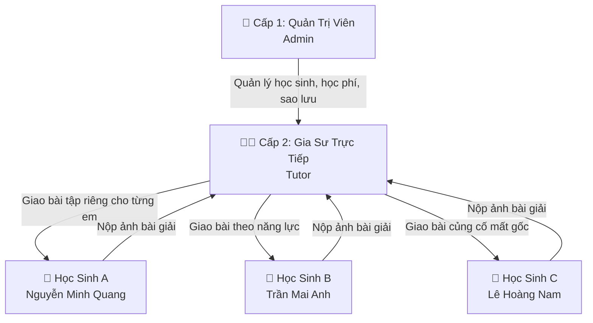

# 📘 KẾ HOẠCH PHÁT TRIỂN ỨNG DỤNG GIAO BÀI TẬP CHO GIA SƯ CÁ NHÂN (EDUTASK PRO)
> **Hệ Thống Quản Lý Lớp Kèm Cá Nhân: 1 Admin + 1 Gia Sư Trực Tiếp + Danh Sách Học Sinh Dạy Kèm**  
> *Phiên bản: v2.0 (Mô hình Tinh Gọn Cá Nhân) | Ngày cập nhật: 06/10/2026*

---

## 📑 MỤC LỤC
1. [Mô Hình Vận Hành Cá Nhân Tinh Gọn](#1-mô-hình-vận-hành-cá-nhân-tinh-gọn)
2. [Cơ Chế Giao Bài Tập Cá Nhân Hóa (1-1) Cho Từng Học Sinh](#2-cơ-chế-giao-bài-tập-cá-nhân-hóa-1-1-cho-từng-học-sinh)
3. [Luồng Nghiệp Vụ Toàn Trình](#3-luồng-nghiệp-vụ-toàn-trình)
4. [Các Phân Hệ Chức Năng Chi Tiết](#4-các-phân-hệ-chức-năng-chi-tiết)
5. [Lộ Trình Triển Khai & Sử Dụng](#5-lộ-trình-triển-khai--sử-dụng)

---

## 1. MÔ HÌNH VẬN HÀNH CÁ NHÂN TINH GỌN

Không cồng kềnh như mô hình trung tâm nhiều giáo viên, hệ thống được tối ưu hóa cho **Gia sư dạy kèm cá nhân** với 3 cấp bậc rõ ràng:



| Cấp Bậc | Vai Trò | Chức Năng Cốt Lõi |
| :--- | :--- | :--- |
| **Cấp 1: Quản Trị (Admin)** | Quản lý lớp kèm chuyên sâu | • **Thêm học sinh với hồ sơ đa chiều:**<br>&nbsp;&nbsp;1. *Thông tin cá nhân:* Họ tên, giới tính, ngày sinh, trường đang học, lớp, SĐT/Zalo, địa chỉ nhà.<br>&nbsp;&nbsp;2. *Thông tin phụ huynh:* Họ tên bố/mẹ, SĐT nhận Zalo báo cáo, nghề nghiệp.<br>&nbsp;&nbsp;3. *Năng lực & Lỗ hổng:* Môn kèm, điểm xuất phát, mục tiêu điểm, lỗ hổng kiến thức cần bù, điểm mạnh.<br>&nbsp;&nbsp;4. *Học phí & Lịch học:* Mức phí/buổi, hình thức học (1-1/online), lịch học cố định, ngày bắt đầu.<br>• Theo dõi học phí: Tự động tính học phí theo số buổi học trong tháng.<br>• Xem hồ sơ chi tiết (Profile Viewer) & Sao lưu dữ liệu JSON. |
| **Cấp 2: Gia Sư Trực Tiếp** | Giảng dạy & Chuyên môn | • **Giao bài tập riêng cho từng học sinh (Cá nhân hóa 1-1)** theo đúng lỗ hổng kiến thức.<br>• **Bàn chấm bài bút đỏ trực quan (Canvas)**: Vẽ bút đỏ, highlight, đóng dấu ✔️/❌/⭐.<br>• Nhắc nhở hạn nộp bài, gửi lời nhận xét và chấm điểm thang 10. |
| **Cấp 3: Học Sinh (Quang, Mai Anh, Nam)** | Người học | • Xem **To-Do List** bài tập của riêng mình (không bị lẫn bài của bạn khác).<br>• Chụp ảnh vở bài làm nộp lên hệ thống.<br>• Mở xem lại bài giải đã được thầy cô chấm bút đỏ kèm lời phê. |

---

## 2. CƠ CHẾ GIAO BÀI TẬP CÁ NHÂN HÓA (1-1) CHO TỪNG HỌC SINH

* **Giao bài đích danh 1-1:**
  * Ví dụ: Em *Nguyễn Minh Quang* đang yếu phần "Bất đẳng thức", Gia sư chọn đích danh em Quang để giao phiếu bài tập này. Các học sinh khác sẽ không thấy bài.
* **Giao bài chung cho cả lớp:**
  * Khi cả lớp cùng học xong một chuyên đề chung (Ví dụ: "Khảo sát hàm số"), Gia sư chọn chế độ "Giao cho cả lớp" chỉ với 1 thao tác.
* **Hình thức nộp bài bằng ảnh chụp:**
  * Học sinh làm bài ra giấy viết tay bình thường, chụp ảnh nộp lên. Gia sư chấm trực tiếp trên ảnh bài làm bằng cọ vẽ bút đỏ.

---

## 3. LUỒNG NGHIỆP VỤ TOÀN TRÌNH

```text
[BƯỚC 1: ADMIN QUẢN LÝ HỌC SINH]
Admin thêm học sinh mới: Tên, lớp, mức học phí 200k/buổi, mục tiêu điểm số 8.5.

[BƯỚC 2: GIA SƯ GIAO BÀI TẬP 1-1]
Gia sư mở app -> Bấm "Giao bài tập mới" -> Tích chọn riêng em Quang -> Đặt hạn nộp 21h00 tối Thứ 5.

[BƯỚC 3: HỌC SINH LÀM BÀI & NỘP ẢNH]
Em Quang mở app -> Thấy bài tập của mình -> Làm ra vở, chụp ảnh bài giải và bấm nộp.

[BƯỚC 4: GIA SƯ CHẤM BÚT ĐỎ TRỰC QUAN]
Gia sư mở bàn chấm Canvas: Dùng bút đỏ khoanh vùng chỗ nhầm dấu -> Đóng dấu ✔️ ở câu đúng -> Cho điểm 8.5/10 -> Bấm "Trả bài".

[BƯỚC 5: XEM KẾT QUẢ & THEO DÕI TIẾN ĐỘ]
- Học sinh mở xem lại bài giải có nét vẽ bút đỏ của thầy cô.
- Admin ghi nhận số buổi học và cập nhật tiến độ điểm số của học sinh.
```
